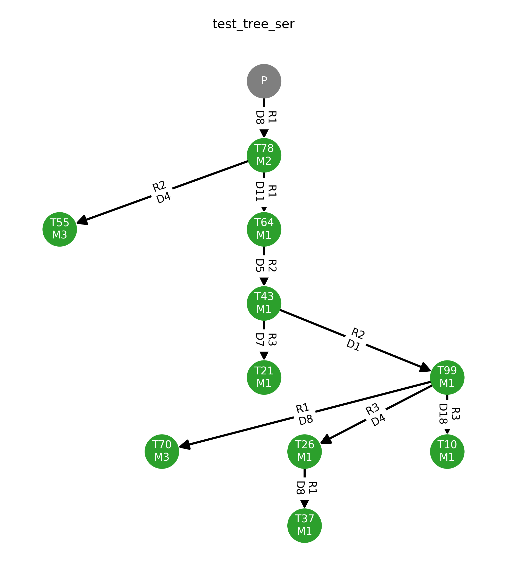

# Serverless Layout Adaptation with Memory-Bounds and User Constraints (SLAMBUC)

[](https://pypi.org/project/SLAMBUC/)

[](https://pypi.org/project/SLAMBUC/#history)
[](https://pepy.tech/project/slambuc)
[]((https://img.shields.io/github/license/hsnlab/SLAMBUC))

[](https://github.com/hsnlab/SLAMBUC/actions/workflows/python-alg-tests_py3.12.yml)
[](https://github.com/hsnlab/SLAMBUC/actions/workflows/python-alg-tests_py3.13.yml)
[](https://github.com/hsnlab/SLAMBUC/actions/workflows/python-alg-tests_py3.14.yml)
[](https://github.com/hsnlab/SLAMBUC/actions/workflows/python-alg-validation.yml)
[](https://github.com/hsnlab/SLAMBUC/actions/workflows/python-cli-validation.yml)

Collection of graph partitioning algorithms implemented in Python for composing cloud-native
applications from standalone serverless functions in a cost-efficient and latency-constrained manner.

## Overview

In the context of serverless computing, **function fusion** is a novel, high-level approach to improve
performance and at the same time reduce the operational cost of serverless applications consisting
of stateless, ephemeral functions. This is achieved by grouping, encompassing, and assembling connected
FaaS functions into separate composite components representing the deployable software artifacts that
are provisioned by the serverless frameworks in the same way as other simple functions.
In addition, different user-defined Quality of Service (QoS) constraints should be also taken into
account, e.g., overall response time of the application or an **end-to-end latency constraint** on the critical
path in the application's call graph.

Under the hood, this problem can be formalized as **the node partitioning of the application's call graph** (DAG)
into disjoint, connected subgraphs in a cost-efficient manner, while specific requirements imposed by
the user and the platform (flavors) itself need to be satisfied.

In this package, called **SLAMBUC**, we designed, implemented, and collected various partitioning algorithms
tailored to chain, tree, and also DAG-shape serverless applications with different runtime complexity,
considering communication parameters and requirements. Our main goal is to find the cost-optimal grouping
of functions concerning node and edge-weighted trees and **cost/memory/latency models** based on public cloud
frameworks, whereas each flavor imposes an upper limit on the available operative memory.
Moreover, a user-given latency constraint has to be fulfilled on the overall execution of the application
graph's **critical path**, which is defined as the subchain between the first/front-end function, i.e.,
the `root` node, and a predefined leaf/tail node marked as `end` or `cp_end` node.

## Installation

### Environment

Our implementations require and support Python3.10 or above.
The following code snippet can be used to set up the latest Python environment on Ubuntu.

```bash
sudo add-apt-repository -y 'ppa:deadsnakes/ppa' && sudo apt update
sudo apt install python3.14 python3.14-dev python3.14-venv
sudo curl -sS https://bootstrap.pypa.io/get-pip.py | sudo python3.14
```

### SLAMBUC package

The recommended way to get our algorithms collected in [SLAMBUC](slambuc) is to create a virtual environment and
install the latest SLAMBUC package from [PyPI repository](https://pypi.org/project/SLAMBUC/) in it.

```bash
$ python3.14 -m venv .venv
$ . .venv/bin/activate
(.venv) $ python3.14 -m pip install slambuc
```

However, for the latest changes, it can be installed directly from GitHub as follows.

```bash
python3.14 -m pip install --no-cache-dir git+https://github.com/hsnlab/SLAMBUC.git
```

Tree plotting relies on networkx's internal plotting feature that generates a layout based on the
[graphviz tool and its python frontend](https://pygraphviz.github.io/documentation/stable/install.html).
Thus, in that case, the related dependencies must be installed first.

```bash
sudo apt-get install graphviz graphviz-dev
```

##### Linear Programming-based Models

External solvers can also be used in LP-based algorithms that require the given solver packages to be
preinstalled and available for the [PuLP frontend](https://github.com/coin-or/pulp).
Currently, the following solvers are tested.

* CBC (default solver, compiled binary is packaged with PuLP)
* GLPK (see installation [here](https://coin-or.github.io/pulp/main/installing_pulp_at_home.html#linux-installation))
* CPLEX ([installation](https://www.ibm.com/products/ilog-cplex-optimization-studio)
  and [setup](https://coin-or.github.io/pulp/guides/how_to_configure_solvers.html#cplex))

For Alpine-based linux derivatives, e.g., using slim docker images, CBC solver cannot be used as it is compiled
with `glibc` but Alpine relies on `musl`.
In this case, the open-source GLPK should be installed and used for SLAMBUC.

```bash
# on Ubuntu
sudo apt-get install glpk
# on Alpine
apk add glpk
```

It is worth noting that CPLEX's python wrapper [docplex](https://pypi.org/project/docplex/)
(as a replacement for PuLP) is left behind the latest Python version.
For using the CPLEX python API, requirements are prepared separately for **Python3.12**.

```bash
python3.12 -m pip install -U -r requirements_py3.12.txt
```

For solving _constrained shortest path_ problems (CSP), we apply solution methods from
[cspy](https://github.com/torressa/cspy).

### Plotting and input generation

Beside the core algorithm implementations, SLAMBUC is delivered with extra features and tools for

- visualizing application trees and partitioning by drawing trees in topology layouts (`matplotlib`, `pygraphviz`),
- evaluating and summarizing partitioning results (`tabulate`),
- executing some tree partitioning ILP models using CPLEX's own Python wrapper (`docplex`)
- generating random and empirical distribution-based application call graphs (`scipy`, `pandas`), and
- storing application call trees in SLAMBUC's own compressed binary format (`numpy`).

For the required additional dependencies, the following command should be executed:

```bash
python3.14 -m pip install slambuc[extra]
```

### Test harness and performance validation

Our repository contains separate test scripts under the [tests](tests) folder for

- validating the input/output formats, call parameters, and caching formats,
- compare the results of different algorithm implementations, models, and solvers,
- test and validate the CLI frontend and its parameters,
- and validates the packaging options and docker image creation.

These test cases also serve as examples for invoking and using the different algorithm implementations
of our package.

For comparative analyses, we also implemented a test harness under [validation](validation)
to automatize test executions with generated test input graphs from [validation/data](validation/data)
and monitor elapsed time and memory demands of tested algorithms initiated as separate subprocesses.

To install additional test and validation dependencies, run the following commands.

```bash
python3.14 -m pip install slambuc[tests]      # For executing tests
pathon3.14 -m pip install slambuc[validation] # For using our test harness framework
```

## Usage

Primarily, SLAMBUC is designed as a _software package_ for a specific collection of graph
partitioning algorithms.

Refer to the wiki for the related
[formats, execution parameters, examples, and API documentation](https://github.com/hsnlab/SLAMBUC/wiki).

### Example for direct import and invocation

The following code snippet brings an example for generating a random tree, that is fully compliant with
SLAMBUC's expected graph input, and invokes a well-performing partitioning pseudo-polynomial
graph partitioning algorithm.

```python
from slambuc.alg.tree.serial.pseudo import pseudo_ltree_partitioning
from slambuc.misc.random import get_random_tree

# Generate an example application call tree randomly
tree = get_random_tree(nodes=10)  # Assuming random memory demands are in GB
# Collect input parameters
params = dict(tree=tree,
              root=1,  # Root node ID
              M=6,  # Memory upper limit
              L=450,  # Latency upper limit
              cp_end=10,  # Critical path: [root -> cp_end]
              delay=10)  # Platform delay in ms

# Invoke a partitioning algorithm
res = pseudo_ltree_partitioning(**params)
# Result is a tuple of optimal partitioning (list of lists of partition blocks),
# its optimal cost, and the derived latency of the critical path [root -> cp_end]
print(f"Part: {res[0]}, opt. cost: {params['M'] * (res[1] / 1000)} GBs, latency: {res[2]} ms")
"Part: [[1, 2], [3, 4], [5, 6, 7, 8], [9], [10]], opt. cost: 7.512 GBs, latency: 449 ms"
```

### CLI

Additionally, SLAMBUC also provide a full-featured [CLI](slambuc/tool/cli.py)
based on the [click](https://click.palletsprojects.com/en/stable/) framework
for directly invoking partitioning algorithms with

- an application call graph/chain serialized in a file, and
- algorithmic parameters defined as console arguments.

During installation a helper script, called `slambuc`, is also installed for calling the implemented algorithms
directly form the command line interface. E.g.:

```bash
(.venv) $ slambuc -h
Usage: slambuc [OPTIONS] COMMAND [ARGS]...

  Serverless Layout Adaptation with Memory-Bounds and User Constraints (SLAMBUC).

Options:
  -j, --json     Output as valid JSON
  -s, --split    Split result into separate lines
  -q, --quiet    Suppress logging messages
  -v, --version  Show the version and exit.
  -h, --help     Show this message and exit.

Commands:
  chain  Sequence partitioning algorithms.
  dag    DAG partitioning algorithms.
  ext    External partitioning algorithms and heuristics.
  tree   Tree partitioning algorithms.

  See https://github.com/hsnlab/SLAMBUC for more details.
```

Moreover, for specific cases the CLI can be invoked directly with
`python3.14 -m slambuc` or `python3.14 -m slambuc.tool.cli`.

For the proper argument names and types, on which the CLI validates the given command line options,
check the internal help by calling any subcommand with the `-h` or `--help` flag. E.g.:

```bash
(.venv) $ slambuc chain path dp --help
Usage: slambuc chain path dp [OPTIONS] FILENAME

  Cost-optimal partitioning based on (vectorized) dynamic programming.

Options:
  --alg [chain|vector]   Specific algorithm to be run  [default: vector]
  --M INT                Upper memory bound for blocks  [default: inf; x>0]
  --N INT                Available vCPU cores for blocks  [default: 1; x>0]
  --L INT                Latency limit for critical path  [default: inf; x>0]
  --start <IDX>          Head node index of the critical path  [default: 0; 0<=x<n]
  --end <IDX>            Tail node index of the critical path  [default: (n-1); 0<=x<n]
  --delay INT            Invocation delay between blocks  [default: 1; x>0]
  --unit INT             Rounding unit for cost calculation  [default: 1; x>0]
  --unfold / --barriers  Return full blocks or barrier nodes only  [default: barriers]
  -h, --help             Show this message and exit.
```

CLI positional parameters follow SLAMBUC's [package structure](slambuc/alg), while most of the algorithmic parameters
that have default parameters can be defined via command line are exposed as optional parameters.

#### Example for chain partitioning from CLI

```bash
(,venv) $ slambuc chain path dp ./tests/data/chain_test_sequence_serial.npz --M=6 --N=2 --L=500 --unit=100 --unfold
Importing algorithm function: <vec_chain_partitioning> from SLAMBUC module: <slambuc.alg.chain.path.dp>
Loading input data from file: /home/czentye/projects/SLAMBUC/tests/data/chain_test_sequence_serial.npz
Parsed input:
  - runtime: [20, 40, 50, 20, 70, 40, 50, 60, 40, 10]
  - memory: [3, 3, 2, 1, 2, 1, 2, 1, 2, 3]
  - rate: [1, 1, 2, 2, 1, 3, 1, 2, 1, 3]
Collected parameters:
  - M: 6
  - N: 2
  - L: 500
  - start: 0
  - end: None
  - delay: 1
  - unit: 100
  - unfold: True
Executing partitioning algorithm...
  -> Algorithm finished successfully in 0.463431 ms!
Received FEASIBLE solution:
([[0], [1, 2], [3, 4], [5], [6, 7, 8], [9]], 1200, 405)
```

#### Example for tree partitioning from CLI

```bash
(.venv) $ slambuc tree serial pseudo ./tests/data/graph_test_tree_random.gml  --root=1 --M=6 --L=450 --cp_end=10 --delay=10
Importing algorithm function: <pseudo_ltree_partitioning> from SLAMBUC module: <slambuc.alg.tree.serial.pseudo>
Loading input data from file: /home/czentye/projects/SLAMBUC/tests/data/graph_test_tree_random.gml
Parsed input:
  - tree: DiGraph named 'random_tree_1759849079.887418' with 11 nodes and 10 edges
Collected parameters:
  - root: 1
  - M: 6
  - L: 450
  - cp_end: 10
  - delay: 10
  - bidirectional: True
Executing partitioning algorithm...
  -> Algorithm finished successfully in 0.454337 ms!
Received FEASIBLE solution:
([[1, 3], [2, 4], [5], [6, 8, 9], [7], [10]], 953, 346)
```

#### Input format

The CLI supports the following input graph formats:

- Graph as **DAG**:
    - networkx's standard [GML format](https://networkx.org/documentation/stable/reference/readwrite/gml.html) (_*.gml_)
- Graph as **tree**:
    - networkx's GML format (_*.gml_)
    - SLAMBUC's [own concise format](slambuc/misc/io) (_*.svt_, or _*.npy_)
    - SLAMBUC's own format in plain text (_*.csv_)
- Sequence metrics as **chain**:
    - `numpy`'s native format (_*.npy_, _*.npz_)
    - plain text format (_*.csv_)

For graph formats, SLAMBUC has some prerequirements, such as metrics must be integers,
or graph has an entry node called `PLATFORM`.
Refer to the wiki for the related
[formats, execution parameters, examples, and API documentation](https://github.com/hsnlab/SLAMBUC/wiki).

To serialize networkx-based graph objects, the following code snippet in Python brings an example:

```python
from slambuc.misc.random import get_random_tree
from slambuc.misc.io import save_tree
import networkx as nx

tree = get_random_tree(10)
# networkx format
nx.write_gml(tree, 'example.gml')
# SLAMBUC format
save_tree(tree, 'example.svt')
# or
save_tree(tree, 'example.csv', raw=False)
```

The `.svt`, `.npy` extensions can be used interchangeably for the `save_tree()` function as native formats,
while `.csv` as plain text encoding is primarily supported for portability.

Fundamentally, SLAMBUC's tree encoding format is based on the numpy vectors encompassing

- the tree's structure as its unique **Prüfer sequence**, and
- lists of **node/edge metrics** (runtime, memory, rate, data).

For more information, see the related inline document of the `encode_service_tree()` function
in `slambuc.misc.io`.

For serializing chain metrics as arrays of equal sizes, the `numpy` package can be used to easily
store the metric arrays **strictly following the order** of:

1. runtime
2. memory
3. rate
4. data (optional, depending on the called algorithm)

The following code snippet in Python brings an example for saving an application call chain:

```python
import numpy as np

# Define metrics
runtime = [20, 40, 50, 20, 70, 40, 50, 60, 40, 10]
memory = [3, 3, 2, 1, 2, 1, 2, 1, 2, 3]
rate = [1, 1, 2, 2, 1, 3, 1, 2, 1, 3]

# Save as native numpy arrays based on the strict metrics order
np.save('example_chain.npy', [runtime, memory, rate])
# Save in numpy's container format with corresponding keys
np.savez('example_chain.npz', runtime=runtime, memory=memory, rate=rate)
# Save in plain text CSV
np.savetxt('example_chain.csv', [runtime, memory, rate], delimiter=',', fmt='%i')
```

SLAMBUC expects list of metrics lists of **size 3** for simpler algorithms (no data externalization)
and of **size 4** for algorithms with more complex computation models.
Therefore, to avoid ambiguity, chain formats `.npy` and `.csv` can be used with the exact size,
whereas `.npz` can be used for all chain partitioning algorithms as stored metric lists are properly labelled in it.

Example serialized inputs for testing can be also found under the [test folder](tests/data).

#### Output format

Calculated result(s) are printed to the _standard output_ (stdout) with the format:

- `(<partitioning>, <cost>, <latency>)` as (one of the) cost-minimal partitioning, or
- `[(<partitioning>, <cost>, <latency>), ...]` in case the used algorithm results in all cost-minimal outcomes.

The resulted partitioning encodes the calculated partition blocks, as a list that consists of, for example,

- barrier nodes,
- list of nodes of the blocks,
- list of blocks and the assigned flavor represented also as a list of flavor metrics, etc.

For the proper output partitioning format and related CLI settings (e.g., `--unfold`, `--full`, `--barriers`, etc.),
see the inline documentation of the invoked algorithm.

Basically, logs are write out to _standard error_ (stderr), thus result can be easily processed programmatically by
parsing only the standard output. Nevertheless, `slambuc` can supress logs with the `-q/--quiet` flag.

For easier output processing, the `-j/--json` flag can be used to automatically convert the printed result,
that follows the Python's internal representation, into **JSON**-compliant format, while the flag `-s/--split`
splits the results, either the triplets of one partitioning, or the list of multiple partitioning
into separate lines.

For example, to list the partitioning, cost, and latency results per line in JSON and discard logs manually, use

```bash
(.venv) $ slambuc -j -s tree layout ilp ./tests/data/graph_test_tree_ser.gml --cp_end=10 --flavor=3,2,1 --flavor=6,1,2 2>/dev/null
[[[1, 2], [6, 1, 2.0]], [[3, 4, 5], [3, 2, 1.0]], [[6, 8, 9], [3, 2, 1.0]], [[7], [6, 1, 2.0]], [[10], [3, 2, 1.0]]]
779.0
398.0
```

or just print the optimal partitioning results, one per line, use

```bash
(.venv) $ slambuc -s -j -q  tree path greedy ./tests/data/graph_test_tree_random.gml --cp_end=10 --L=500 --cuts --unit=10
[[[1, 3], [2], [4], [5], [6], [7], [8], [9, 10]], 890, 3]
[[[1, 3], [2], [4], [5], [6], [7], [8], [9], [10]], 890, 4]
[[[1, 2], [3], [4], [5], [6], [7], [8], [9, 10]], 890, 4]
[[[1, 2], [3], [4], [5], [6], [7], [8], [9], [10]], 890, 5]
[[[1], [2], [3], [4], [5], [6], [7], [8], [9, 10]], 890, 4]
[[[1], [2], [3], [4], [5], [6], [7], [8], [9], [10]], 890, 5]
```

It is worth noting that CLI parameters are automatically parsed from environment variables in case the following
naming conventions are applied (envvar names are **capitalized**):

- `SLAMBUC_<PARAMETER>`, or
- `SLAMBUC_<PACKAGE_PATH>_<PARAMETER>`.

For the proper variable values, refer to the related 
[Click documentation](https://click.palletsprojects.com/en/stable/options/#values-from-environment-variables).

As an example, to unfold partitioning blocks, the following settings can be leveraged:

```bash
(.venv) $ slambuc -q chain path dp ./tests/data/chain_test_sequence_serial.npz --M=10 --N=2
([0, 1, 5, 6, 9], 500, 404)

(.venv) $ slambuc -q chain path dp ./tests/data/chain_test_sequence_serial.npz --M=10 --N=2 --unfold
([[0], [1, 2, 3, 4], [5], [6, 7, 8], [9]], 500, 404)

(.venv) $ SLAMBUC_UNFOLD=yes slambuc -q chain path dp ./tests/data/chain_test_sequence_serial.npz --M=10 --N=2
([[0], [1, 2, 3, 4], [5], [6, 7, 8], [9]], 500, 404)

(.venv) $ SLAMBUC_CHAIN_PATH_DP_UNFOLD=on slambuc -q chain path dp ./tests/data/chain_test_sequence_serial.npz --M=10 --N=2
([[0], [1, 2, 3, 4], [5], [6, 7, 8], [9]], 500, 404)
```

### Docker image

From version `v0.6.0`, the core SLAMBUC package, including

- the implemented partitioning algorithms with their minimal dependencies and its CLI,
- the GLPK solver, as CBC is not supported in Alpine linux (see [here](#linear-programming-based-models)),
- and some example test input file,

is also provided as a standalone [Docker image](https://hub.docker.com/r/czentye/slambuc), named `czentye/slambuc`.

To pull the image and experiment with SLAMBUC, use the following command:

```bash
$ docker run --rm -ti czentye/slambuc:latest -v
slambuc, version 0.6.0
```

To execute a partitioning algorithm without package installation using one of its included test file, 
use a similar command:

```bash
$ docker run --rm -ti czentye/slambuc:latest tree path meta tests/data/graph_test_tree_ser.gml \
                                                        --M=6 --cp_end=10 --L=370 --delay=10
Importing algorithm function: <meta_tree_partitioning> from SLAMBUC module: <slambuc.alg.tree.path.meta>
Loading input data from file: /usr/src/slambuc/tests/data/graph_test_tree_ser.gml
Parsed input:
  - tree: DiGraph named 'test_tree_ser' with 11 nodes and 10 edges
Collected parameters:
  - root: 1
  - M: 6
  - N: 1
  - L: 370
  - cp_end: 10
  - delay: 10
  - unit: 1
  - only_barr: False
Executing partitioning algorithm...
  -> Algorithm finished successfully in 1.293974 ms!
Received FEASIBLE solution:
([[1, 3], [2], [4, 6], [5], [7], [8, 10], [9]], 888, 2)
```

To execute the latest SLAMBUC codebase from Git and set partitioning timeout to be 3 seconds by default, 
use the following parameters with docker:

```bash
$ git pull git@github.com:hsnlab/SLAMBUC.git
$ docker run --rm -v "./slambuc:/usr/src/slambuc" -e SLAMBUC_TIMEOUT=3 -ti czentye/slambuc:0.6.0 \
                                                    chain serial ilp tests/data/chain_test_sequence_serial.npy --M=6
Importing algorithm function: <chain_mtx_partitioning> from SLAMBUC module: <slambuc.alg.chain.serial.ilp>
Loading input data from file: /usr/src/slambuc/tests/data/chain_test_sequence_serial.npy
Parsed input:
  - runtime: [20, 40, 50, 20, 70, 40, 50, 60, 40, 10]
  - memory: [3, 3, 2, 1, 2, 1, 2, 1, 2, 3]
  - rate: [1, 1, 2, 2, 1, 3, 1, 2, 1, 3]
  - data: [5, 3, 5, 2, 1, 3, 2, 3, 5, 1]
Collected parameters:
  - M: 6
  - L: inf
  - delay: 1
  - solver: GLPK_CMD
  - timeout: 3
Executing partitioning algorithm...
  -> Algorithm finished successfully in 12.233920 ms!
Received FEASIBLE solution:
([[0], [1, 2, 3], [4, 5, 6, 7], [8, 9]], 653.0, 1022.0)
```

## Performance experiments

Validation results of a subset of our algorithms with a fully serialized block execution model,
which are executed with our [validation script](tests/validate_algs.py) using different configurations
and a [random-generated input call graph](tests/data/graph_test_tree_ser.gml) of size 10.

Used algorithmic parameters (if applicable):

* Root node ID (root): 1
* Memory limit (M): 6
* Available vCPU count (N): 1
* Critical path's end node ID (cp_end): 10
* Latency limit: (L): **500**
* Platform delay: (delay): 10
* Bidirectional elimination (bidirectional): True
* Cost approximation ratio (Epsilon): 0.0
* Latency violation ratio (Lambda): 0.0

One of the example tree with node/edge weights (execution time: **T**, memory: **M**, data R/W: **D**,
invocation rate: **R**) is depicted below:

Exact algorithms are configured to yield all optimal solutions (if exists) with the numerating
format `{alg}_{num}`.

Execution results:

| Algorithm          | Partitioning                                        | Cost | Latency | Time (s)   |
|--------------------|-----------------------------------------------------|------|---------|------------|
| GREEDY_0           | [[1, 2, 3], [4, 5, 6, 8, 9, 10], [7]]               | 858  | 443     | 0.0235749  |
| GREEDY_1           | [[1, 3, 4, 5], [2], [6, 8, 9, 10], [7]]             | 858  | 474     | 0.0235749  |
| GREEDY_2           | [[1, 3, 4, 5], [2], [6, 7, 8, 9], [10]]             | 858  | 471     | 0.0235749  |
| ILP_CFG_HYBRID     | [[1, 3, 4, 5], [2], [6, 8, 9, 10], [7]]             | 858  | 474     | 0.0167496  |
| ILP_MTX            | [[1, 3, 4, 5], [2], [6, 8, 9, 10], [7]]             | 858  | 474     | 0.0197985  |
| PSEUDO_B           | [[1, 2, 3], [4, 5, 6, 8, 9, 10], [7]]               | 858  | 443     | 0.00047041 |
| PSEUDO_L           | [[1, 3, 4, 5], [2], [6, 7, 8, 9], [10]]             | 858  | 471     | 0.00083811 |
| BIFPTAS_L          | [[1, 3, 4, 5], [2], [6, 7, 8, 9], [10]]             | 858  | 471     | 0.00082326 |
| _BASELINE_NO_PART_ | [[1], [2], [3], [4], [5], [6], [7], [8], [9], [10]] | 1090 | 472     | 9.38e-05   |
| _BASELINE_SINGLE_  | [[1, 2, 3, 4, 5, 6, 7, 8, 9, 10]]                   | 822  | 686     | 6.718e-05  |

## Development and contribution

If you would like to contribute, add a feature, or just play with the implementations, the development
environment can be set up with the following commands.

```bash
git clone https://github.com/hsnlab/SLAMBUC.git
pathon3.14 -m pip install -U -r SLAMBUC/requirements.txt
pathon3.14 -m pip install --no-deps -e SLAMBUC/
# OR
cd SLAMBUC && make install-req && make dev-install

## Remove editing-mode package outside of repo root
pathon3.14 -m pip uninstall slambuc
# OR
make uninstall
```

## Publications

If you use one of our algorithms published in this package or our test harness, please consider citing
one of our related works.

#### [Tree partitioning algorithms with explicit state externalization:](https://doi.org/10.1016/j.future.2023.12.010)

J. Czentye and B. Sonkoly,
"Serverless application composition leveraging function fusion: Theory and algorithms,"
_Future Generation Computer Systems_ 153 pp. 403–418., 16 p. (2024),
doi: 10.1016/j.future.2023.12.010.

```bibtex
@ARTICLE{Czentye2024fgcs,
    author = {J{\'{a}}nos Czentye and Bal{\'{a}}zs Sonkoly},
    title = {{Serverless application composition leveraging function fusion: Theory and algorithms}},
    journal = {{Future Generation Computer Systems}},
    volume = {153},
    pages = {403--418},
    year = {2024},
    issn = {0167-739X},
    doi = {https://doi.org/10.1016/j.future.2023.12.010}
}
```

#### [Polynomial-time algorithms based on chain-based tree partitioning:](https://doi.org/10.1109/noms56928.2023.10154412)

J. Czentye, I. Pelle and B. Sonkoly,
"Cost-optimal Operation of Latency Constrained Serverless Applications: From Theory to Practice,"
_NOMS 2023-2023 IEEE/IFIP Network Operations and Management Symposium_, Miami, FL, USA, 2023, pp. 1-10,
doi: 10.1109/NOMS56928.2023.10154412.

```bibtex
@INPROCEEDINGS{Czentye2022noms,
    author = {J{\'{a}}nos Czentye and Istv{\'{a}}n Pelle and Bal{\'{a}}zs Sonkoly},
    booktitle = {{NOMS 2023-2023 IEEE/IFIP Network Operations and Management Symposium}},
    title = {{Cost-optimal Operation of Latency Constrained Serverless Applications: From Theory to Practice}},
    publisher = {{IEEE}},
    year = {2023},
    month = may,
    pages = {1--10},
    doi = {10.1109/NOMS56928.2023.10154412}
}
```

#### [Heuristic algorithm for dynamic (re)optimization control loop in edge-could environments:](https://doi.org/10.1109/jiot.2020.3042428)

I. Pelle, J. Czentye, J. Dóka, A. Kern, B. P. Gerő and B. Sonkoly,
"Operating Latency Sensitive Applications on Public Serverless Edge Cloud Platforms,"
in _IEEE Internet of Things Journal_, vol. 8, no. 10, pp. 7954–7972, 15 May, 2021,
doi: 10.1109/JIOT.2020.3042428.

```bibtex
@ARTICLE{Pelle2021jiot,
    author = {Pelle, Istv{\'{a}}n and Czentye, J{\'{a}}nos and D{\'{o}}ka, J{\'{a}}nos and Kern, Andr{\'{a}}s and Ger{\H{o}}, Bal{\'{a}}zs P. and Sonkoly, Bal{\'{a}}zs},
    journal = {{IEEE Internet of Things Journal}},
    title = {{Operating Latency Sensitive Applications on Public Serverless Edge Cloud Platforms}},
    publisher = {Institute of Electrical and Electronics Engineers ({IEEE})},
    year = {2021},
    month = may,
    volume = {8},
    number = {10},
    pages = {7954--7972},
    doi = {10.1109/JIOT.2020.3042428}
}
```

#### [Layout optimization for serverless applications over public clouds:](https://doi.org/10.1109/globecom38437.2019.9013988)

J. Czentye, I. Pelle, A. Kern, B. P. Gero, L. Toka and B. Sonkoly,
"Optimizing Latency Sensitive Applications for Amazon's Public Cloud Platform,"
_2019 IEEE Global Communications Conference (GLOBECOM)_, Waikoloa, HI, USA, 2019, pp. 1-7,
doi: 10.1109/GLOBECOM38437.2019.9013988.

```bibtex
@INPROCEEDINGS{Czentye2019globecom,
    author = {Czentye, Janos and Pelle, Istvan and Kern, Andras and Gero, Balazs Peter and Toka, Laszlo and Sonkoly, Balazs},
    booktitle = {{2019 IEEE Global Communications Conference (GLOBECOM)}},
    title = {{Optimizing Latency Sensitive Applications for Amazon's Public Cloud Platform}},
    publisher = {{IEEE}},
    year = {2019},
    month = dec,
    pages = {1--7},
    doi = {10.1109/GLOBECOM38437.2019.9013988}
}
```

## License

SLAMBUC is an open-source software licensed under [Apache 2.0](LICENSE).
